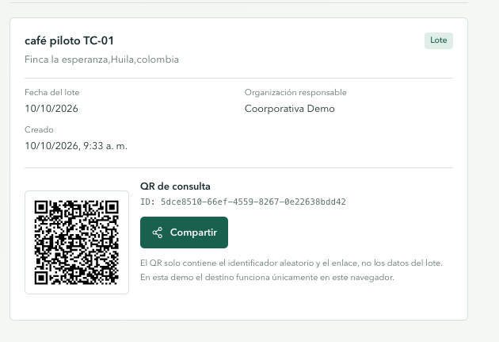

# Documentación del frontend de TrazabiliChain

## 1. Propósito

El frontend presenta el flujo inicial del MVP de TrazabiliChain: registrar un lote con sus datos de origen, consultar su ficha y compartir un enlace mediante un código QR. La interfaz también comunica los límites de la demo: los datos no se guardan en un servidor ni se anclan en Stellar.

La aplicación está en `frontend/soroban-TrazabiliChain`. El workspace de Rust y los contratos Soroban permanecen en el mismo proyecto, pero el frontend actual no invoca esos contratos.

## 2. Tecnologías

- Next.js 16 con App Router.
- React 19 y TypeScript.
- Tailwind CSS 4 mediante el plugin PostCSS.
- GSAP y `@gsap/react` para animaciones.
- `qrcode.react` para generar los códigos QR en el navegador.
- `@zxing/browser` para escanear códigos QR con la cámara.
- Phosphor Icons para los iconos de redes y acciones.
- pnpm como gestor de paquetes y workspace.

## 3. Instalación y ejecución

Desde la raíz del frontend:

```sh
cd frontend/soroban-TrazabiliChain
pnpm install
pnpm dev
```

La aplicación se abre normalmente en `http://localhost:3000`.

Comandos disponibles:

| Comando             | Uso                                                           |
| ------------------- | ------------------------------------------------------------- |
| `pnpm dev`          | Inicia el servidor de desarrollo.                             |
| `pnpm build`        | Genera la compilación de producción.                          |
| `pnpm start`        | Sirve la compilación de producción.                           |
| `pnpm lint`         | Ejecuta ESLint.                                               |
| `pnpm typecheck`    | Verifica los tipos de TypeScript.                             |
| `pnpm format`       | Aplica Prettier a los archivos incluidos en su configuración. |
| `pnpm format:check` | Comprueba el formato sin modificar archivos.                  |

Para publicar el sitio con su dominio definitivo, define `NEXT_PUBLIC_SITE_URL` antes de compilar:

```env
NEXT_PUBLIC_SITE_URL=https://tu-dominio.example
```

El valor por defecto es `http://localhost:3000`, útil solo durante el desarrollo local.

## 4. Rutas y composición

| Ruta o archivo                                                | Responsabilidad                                                         |
| ------------------------------------------------------------- | ----------------------------------------------------------------------- |
| `src/app/page.tsx`                                            | Página principal; compone header, registros, sección Sobre y footer.    |
| `src/app/lote/[id]/page.tsx`                                  | Ruta dinámica de consulta de un lote por identificador.                 |
| `src/app/layout.tsx`                                          | Layout raíz, idioma, metadata general y SplashScreen.                   |
| `src/app/opengraph-image.tsx`                                 | Genera una imagen social de 1200 × 630 píxeles mediante `next/og`.      |
| `src/components/header/Header.tsx`                            | Navegación adaptable y enlace para saltar al contenido.                 |
| `src/components/records-panel/RecordsPanel.tsx`               | Formulario, validación nativa, historial y creación de lotes.           |
| `src/components/lot-sharing/LotSharing.tsx`                   | QR y opciones para compartir el enlace.                                 |
| `src/components/public-lot/PublicLotPage.tsx`                 | Consulta local del lote o aviso de que no está disponible.              |
| `src/components/event-form/EventForm.tsx`                     | Registro de hitos por parte de actores de la cadena.                    |
| `src/components/certificate-form/CertificateForm.tsx`         | Asociación de datos de certificado y huella de evidencia.               |
| `src/components/consumer-scanner/ConsumerScanner.tsx`         | Escaneo de QR con cámara y consulta manual.                             |
| `src/components/organization-members/OrganizationMembers.tsx` | Directorio local de miembros y roles de demo.                           |
| `src/components/buyer-dashboard/BuyerDashboard.tsx`           | Búsqueda de lotes y filtro por evidencia asociada.                      |
| `src/components/audit-dashboard/AuditDashboard.tsx`           | Cronología global y alertas básicas de consistencia.                    |
| `src/components/evidence-file/EvidenceFileLink.tsx`           | Descarga local de archivos de evidencia asociados a lotes o eventos.    |
| `src/lib/lots/lot-storage.ts`                                 | Modelo de lote, eventos, certificados, miembros y sincronización React. |
| `src/lib/lots/evidence-storage.ts`                            | Archivos de evidencia locales en IndexedDB.                             |
| `src/components/about-section/AboutSection.tsx`               | Explica el propósito del producto y los límites de verificación.        |
| `src/components/site-footer/SiteFooter.tsx`                   | Footer y enlaces de demostración a redes sociales.                      |
| `src/components/splash-screen/SplashScreen.tsx`               | Pantalla inicial, progreso y animación de entrada.                      |
| `src/app/globals.css`                                         | Importación de Tailwind, tokens visuales, foco y estilos globales.      |
| `next.config.ts`                                              | Cabeceras HTTP de seguridad.                                            |

## 5. Registro y persistencia

Ejemplo de como deberia quedar 

El formulario de productor requiere producto, características, ubicación de origen, fecha del lote y organización responsable. Los controles HTML `required` impiden el envío normal cuando faltan campos. Al enviar:

1. Se genera un identificador con `crypto.randomUUID()`.
2. Se captura `createdAt` con la fecha y hora del dispositivo.
3. El lote se añade a `localStorage` bajo la clave `trazabilichain-demo-lots`. Los registros antiguos conservan eventos y certificados; si falta la atribución de un rol se presenta como no registrada.
4. El historial se actualiza y presenta fecha de origen y hora de creación.

`useLotRecords` usa `useSyncExternalStore` para leer el snapshot del almacenamiento y notificar cambios locales y eventos de almacenamiento entre pestañas del mismo origen.

## 6. Flujos asociados a las historias de usuario

El selector superior permite recorrer estas pantallas como perfiles de demo:

| Historia                      | Flujo disponible                                                                                                                                                                         |
| ----------------------------- | ---------------------------------------------------------------------------------------------------------------------------------------------------------------------------------------- |
| Productor                     | Crea el lote con origen y características; se genera ID y QR.                                                                                                                            |
| Actor de cadena               | Selecciona un lote y registra tipo, fecha/hora ocurrida, detalle, actor, rol y organización declarados; puede adjuntar evidencia opcional. La fecha de captura también queda registrada. |
| Certificador                  | Asocia nombre, emisor, número y vigencia declarados; selecciona un archivo PDF/imagen. Se captura quién lo asoció, se calcula SHA-256 y el archivo se conserva en IndexedDB local.       |
| Consumidor                    | Escanea el QR con cámara tras conceder permiso, o escribe su ID/URL. La ficha pública local muestra datos, cronología, huellas y archivos de evidencia asociados.                        |
| Administrador de organización | Añade o quita miembros de un directorio local y asigna uno de los roles de demo.                                                                                                         |
| Comprador B2B                 | Busca por producto, origen u organización y puede filtrar certificados cuya vigencia declarada cubre la fecha actual. No se autentica al emisor.                                         |
| Auditor                       | Revisa eventos ordenados por fecha de captura y recibe alertas básicas por fechas inconsistentes, rol ausente o eventos duplicados.                                                      |

Los eventos aceptan evidencia opcional con huella SHA-256. Se evita repetir el mismo evento y se rechaza asociar al lote el mismo número de certificado con la misma huella. Las alertas son comprobaciones simples de consistencia, no detección de fraude. La vigencia, identidad del certificador y legitimidad del documento son declaraciones sin verificación externa. Para usar la cámara se requiere un contexto seguro (HTTPS o localhost) y permiso explícito del navegador.

## 7. QR y opciones de compartir

El QR codifica únicamente una URL con el identificador del lote, con la forma `/lote/{id}`. Los campos del lote no se incluyen en el QR ni en los parámetros de compartir.

El disclosure **Compartir** ofrece correo electrónico, X, LinkedIn, Instagram y copiar enlace. Las opciones de correo y redes generan sus respectivos enlaces de acción. Instagram no ofrece aquí una publicación web directa, por lo que copia la URL al portapapeles para que la persona la pegue en Instagram. Si el navegador bloquea el portapapeles, aparece un campo de solo lectura para copiarla manualmente.

Al abrir `/lote/{id}`, la página busca el lote en el almacenamiento local. Por ello, un enlace o QR solo puede resolver un registro en el mismo navegador y origen donde fue creado. En otro dispositivo, perfil o navegador se mostrará que el registro no está disponible. El escáner acepta solo URLs del mismo origen para evitar redirecciones a dominios externos.

## 8. Accesibilidad y experiencia adaptable

- Se usan landmarks semánticos (`header`, `main`, `section`, `footer`) y encabezados jerárquicos.
- Cada campo tiene una etiqueta asociada y conserva la validación nativa del navegador.
- El botón de compartir utiliza el elemento nativo `details/summary`; puede abrirse con teclado, se cierra al pulsar fuera, al mover el foco fuera o al seleccionar una acción.
- `Escape` cierra el menú y devuelve el foco al control que lo abrió.
- Las acciones e iconos tienen nombres accesibles; los iconos decorativos se ocultan a lectores de pantalla.
- Los resultados de copia se anuncian mediante una región `role="status"`.
- El foco visible se define globalmente y las vistas usan layouts adaptables de Tailwind.
- El SplashScreen y las animaciones de GSAP respetan `prefers-reduced-motion`.
- El escáner anuncia estados, permite detener la cámara y ofrece entrada manual como alternativa.

## 9. SEO y metadatos sociales

`src/app/layout.tsx` define título, descripción, aplicación, palabras clave, canonical, robots, Open Graph y Twitter Cards. `src/app/opengraph-image.tsx` genera la imagen que usan Open Graph y Twitter como `summary_large_image`.

Configura `NEXT_PUBLIC_SITE_URL` con el dominio HTTPS público para que canonical, `og:url` e imagen Open Graph se resuelvan como URLs absolutas correctas. La imagen social se sirve en `/opengraph-image`.

## 10. Cabeceras y seguridad

`next.config.ts` configura Content Security Policy, `Referrer-Policy`, `X-Content-Type-Options`, `X-Frame-Options`, `Permissions-Policy` y otras cabeceras. HSTS y `upgrade-insecure-requests` se habilitan solo en producción; `unsafe-eval` se añade únicamente en desarrollo para las herramientas de Next.

Estas cabeceras son defensa en profundidad y no sustituyen autenticación, autorización, validación del lado servidor ni controles de acceso a datos. La política CSP actual mantiene `unsafe-inline` por compatibilidad con el render e hidratación de Next; una CSP estricta con nonce requeriría una estrategia de respuesta dinámica.

## 11. Límites del prototipo

- No hay API, base de datos remota, inicio de sesión ni roles autenticados. Sí existen pantallas de roles de demostración, pero no son una capa de autorización.
- Los perfiles y pantallas se simulan en el cliente. Ocultar formularios por rol no constituye autorización; cualquier persona con acceso al navegador puede cambiar de perfil o alterar `localStorage`.
- El navegador es la fuente de persistencia: lotes, eventos, metadatos de certificados y miembros usan `localStorage`; los documentos seleccionados usan IndexedDB. Borrar los datos del sitio elimina estos registros y evidencias.
- La hora de creación proviene del reloj del dispositivo y no es un sello de tiempo confiable.
- El QR permite localizar una ficha solo en el navegador local; no prueba identidad, autorización, integridad on-chain ni veracidad del lote.
- La huella SHA-256 permite comparar bytes, pero no autentica al emisor ni certifica la sostenibilidad.
- Los enlaces de redes sociales del footer son ejemplos y no perfiles oficiales.
- No se deben registrar datos personales, documentos privados ni información sensible en esta demo.

Para permitir consultas reales desde otros dispositivos, el siguiente paso es integrar persistencia del lado servidor, autenticación y autorización por organización. La ruta pública deberá exponer únicamente los campos autorizados; el cliente no puede ser la autoridad de seguridad. También queda pendiente decidir la opción de contrato (A o B) y documentar por qué se elige antes de integrar el anclaje Soroban.

Nota: queda faltando la opción de contratos se eligió (A o B) y por qué. Ya que esto requiero verlo en la otra clase o seguir investigando para implementarlo
